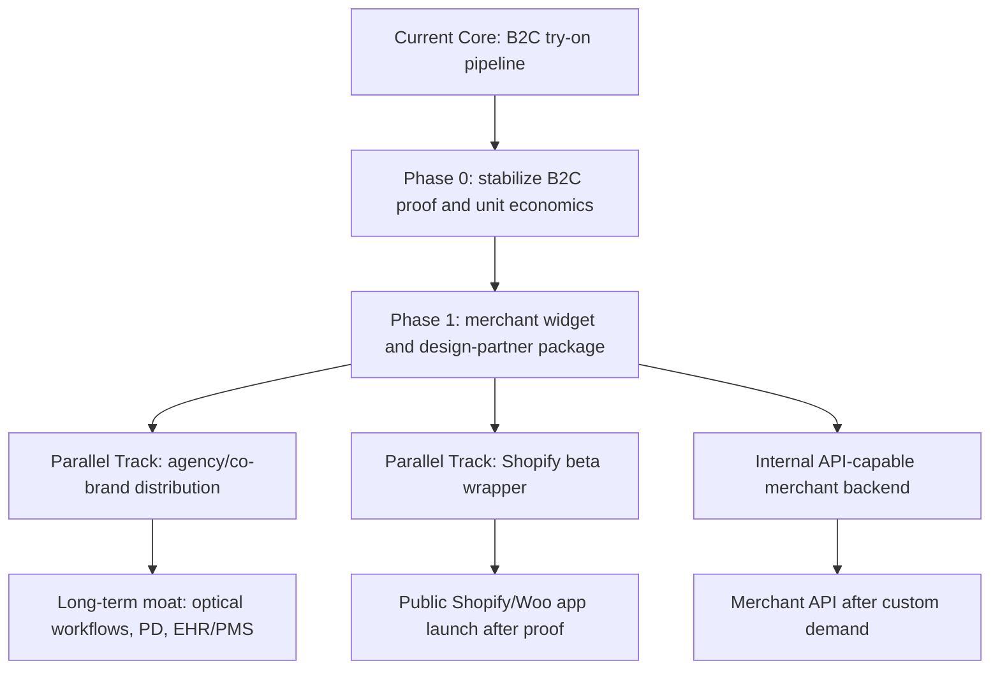

# VisuTry B2B Commerce Commercialization Roadmap

**Date**: 2026-05-25

**Scope**: Productize the proven VisuTry glasses try-on pipeline for merchants, eyewear brands, resellers, and commerce platforms.

**Primary goal**: Convert VisuTry from a B2C try-on product into a reusable B2B commerce capability, with the generic widget and agency/design-partner motion as the main validation path and Shopify/WooCommerce beta work running in parallel where AI-assisted development keeps cost low.

---

## 1. Current State

VisuTry has moved past pure product validation. The system has operated in production for roughly 6 months, supported nearly 2,000 user try-ons, and produced 3 verified non-test paid customers. The live paid path is concentrated in the glasses try-on flow and the USD 2.99 Credits Pack.

The important signal is not the size of revenue yet. The important signal is that the try-on pipeline works end to end:

1. A user uploads a face image and an item image.
2. VisuTry stores the images and creates a `TryOnTask`.
3. The AI service processes the task asynchronously.
4. The user can view results, history, and share links.
5. The quota and Stripe payment system can convert usage into paid credits.
6. Admin tools can inspect users, payments, and task activity.

This means VisuTry already has a commercializable unit: one AI glasses try-on generated from user and product imagery.

### Research Update

Two external commercialization studies reviewed on 2026-05-25 reinforce the same core direction:

- Do not keep VisuTry primarily as a standalone B2C credits tool. B2C usage is useful evidence, but the stronger monetization layer is merchant workflow, not consumer entertainment.
- The strongest initial wedge is merchant-facing virtual try-on for eyewear product pages: a generic embedded widget, lightweight merchant analytics, and a controlled top-SKU pilot.
- Shopify is strategically important because it concentrates DTC eyewear merchants, trusted billing, app discovery, and standard product-page extension patterns.
- WooCommerce is a logical second platform because of reach, but WordPress/theme fragmentation makes it more support-heavy.
- BigCommerce and raw API sales should come later unless a specific high-quality buyer pulls them forward.
- Reseller/co-brand remains useful, but the inactive Libya lead should not drive engineering. The better reseller path is likely boutique Shopify/WooCommerce agencies that already serve fashion, eyewear, and accessories merchants.
- AI-assisted development reduces the cost of producing widget and platform wrappers, but it does not remove the hard parts: distribution, merchant trust, privacy, security, mobile performance, support, and proof of conversion lift.

The updated strategic interpretation is:

> Build one reusable try-on backend, sell one merchant workflow, distribute through multiple shells.

Code is not the durable moat. The durable moat must become distribution, merchant onboarding, vertical workflow depth, privacy trust, ROI analytics, and eventually hard-to-copy optical workflows such as PD measurement, pre-shop, walk-out recovery, and EHR/PMS integration.

---

## 2. Existing Assets

### Product and User Evidence

- Paid customers bought low-friction credits, not subscriptions.
- Paid usage is concentrated in glasses, not the broader universal try-on categories.
- One validated persona compares many frames.
- Another validated persona tries one specific frame from a product image, email, or screenshot.
- Current live pricing configuration supports a USD 2.99 Credits Pack for 30 AI try-ons.

Reference: `docs/strategy/2026-05-25-paid-customer-seo-geo-relaunch-plan.md`.

### Technical Assets

Current reusable system pieces:

- `src/app/api/try-on/submit/route.ts`: authenticated form upload entry point for try-on tasks.
- `src/app/api/try-on/poll/route.ts`: authenticated polling and completion handling.
- `src/lib/tryon-service.ts`: core try-on service wrapper around image storage and AI processing.
- `src/lib/quota.ts`: user quota checks and deduction.
- `src/config/pricing.ts`: live B2C pricing and quota configuration.
- `prisma/schema.prisma`: `User`, `TryOnTask`, `Payment`, and related models.
- `src/components/try-on/TryOnInterface.tsx`: reusable B2C try-on UI flow.
- `src/app/api/share/*` and share pages: public result sharing surface.
- Admin pages under `src/app/(admin)/admin/*`: operational visibility.

### Strategy Assets

Existing B2B-adjacent plans already exist, but they are not yet implemented as a merchant platform:

- `docs/strategy/reseller-technical-roadmap.md`: co-branding, reseller roles, credit transfer, privacy guardrails.
- `docs/strategy/analytics/gtm.md`: content idea for embedding VisuTry into ecommerce sites.
- `docs/strategy/content/3-month-content-strategy.md`: long-term API partnerships with eyewear brands.
- `.agent/workflows/process-partner-inquiry.md`: partner inquiry operating workflow.

---

## 3. Commercialization Thesis

VisuTry should not present itself first as a generic AI image tool or a pure consumer utility. The stronger B2B claim is:

> Add AI glasses try-on to a product page, sales flow, or partner channel without building an AI pipeline.

The current pipeline can support four related commercial products:

| Product | Buyer | Delivery Model | Why It Fits Now |
| --- | --- | --- | --- |
| Commerce Widget | online store, DTC brand, Shopify/Woo merchant | iframe or script embed | Strongest first commercial shell; solves the product-page job directly. |
| Agency / Co-Brand Pilot | Shopify/Woo agency, optical ecommerce implementer, reseller | white-label or co-branded merchant rollout | Solves distribution by borrowing existing client trust. |
| Platform App Beta | Shopify first, WooCommerce second | app wrapper around the same widget/backend | AI-assisted development makes beta wrappers cheap enough to explore in parallel. |
| Merchant API | technical merchant, eyewear brand, integration partner | server-to-server API | Important capability layer, but usually a later monetization surface. |

Shopify or other commerce platform apps should be treated as distribution shells for the widget and merchant backend, not as separate products. The previous roadmap treated Shopify as clearly later. The revised view is more nuanced: build the generic widget and merchant backend as the core, but allow a Shopify beta wrapper to proceed in parallel if it does not distract from merchant validation, security, privacy, and support readiness. Public app-store launch still requires proof from real merchants, because reviews, protected-customer-data requirements, billing rules, and support quality can punish immature onboarding.

---

## 4. Recommended Sequence



### Phase 0: Stabilize the Paid B2C Loop

Goal: make the current commercial proof stronger before amplifying it through merchants.

Tasks:

- Ship the post-result Credits Pack CTA.
- Audit paid-task failure behavior and credit deduction safety.
- Track the funnel from result view to pricing click, checkout start, payment completion, and paid try-on usage.
- Keep the product focus on glasses and product-image or screenshot try-on.
- Refresh the current SEO/GEO cluster around AI glasses try-on, screenshot try-on, and frame comparison.

Success criteria:

- Paid task success rate is visible.
- Credit deduction behavior is reliable and documented.
- Credits Pack conversion can be measured.
- The business can clearly state the cost, conversion rate, and reliability of one try-on unit.

### Phase 1: Merchant Widget and Design-Partner Package

Goal: validate that eyewear merchants will place VisuTry on real product pages and judge it by business outcomes, not by demo novelty.

Current status: the previously discussed reseller-style lead is no longer active. The last exploratory pilot proposal did not receive follow-up, so that specific attempt is on indefinite hold. Do not build partner-specific engineering for that lead. The next Phase 1 target should be new responsive DTC eyewear merchants, Shopify-native stores, independent optical retailers with online sales, or agencies that already serve those merchants.

Product shape:

- A merchant enables try-on on a constrained top-SKU set, not the full catalog.
- The first integration can be a VisuTry-hosted preview, iframe modal, or one-line script depending on merchant readiness.
- The merchant receives basic analytics: widget impressions, try-on opens, completed try-ons, failures, device split, and product/SKU usage.
- The merchant does not receive raw shopper face images by default.
- Credits remain an internal cost-control mechanism; the buyer-facing story should be pilot fee, monthly quota, or enabled-SKU package.

Minimum data to track:

- Merchant or agency ID.
- Product ID / SKU / external reference.
- Enabled product-page URL.
- Widget impression.
- Try-on started.
- Try-on completed.
- Try-on failed.
- Add-to-cart or conversion event where integration permits.
- Successful render cost and failed render count.
- Payment or offline invoice reference.

Commercial package:

- **Design Partner Pilot**: setup fee plus 30-day quota on 5-20 top SKUs.
- Suggested initial test: 3-5 merchants, 100-500 successful renders per merchant, 30-day usage window.
- Primary buyer: Shopify-native DTC eyewear brand, small-to-mid online eyewear retailer, digitally forward independent optical shop, or boutique commerce agency with eyewear/fashion clients.

Success criteria:

- At least 3 merchants or 1 agency-backed merchant group place VisuTry on real product pages or realistic preview pages.
- Product-page try-on open rate and completion rate are measurable.
- Try-on users show stronger engagement or add-to-cart intent than non-try-on users, where measurable.
- Merchants can name a concrete use case: conversion lift, confidence, top-SKU merchandising, pre-store consideration, or reduced hesitation.
- At least one merchant is willing to continue into a monthly plan, expanded SKU coverage, or public case study.

### Phase 2: Merchant Backend and Internal API Capability

Goal: make VisuTry merchant-ready internally before selling a raw API as the main product.

The research argues against API-first sales for early merchants: it pulls technical buyers into the cycle, turns onboarding into custom integration, and excludes most SMB/DTC buyers. However, the backend should still become API-capable because the widget, Shopify wrapper, WooCommerce wrapper, and future agency integrations all need the same core merchant system.

Minimal internal API surface:

| Endpoint | Purpose |
| --- | --- |
| `POST /api/v1/try-on` | Create a try-on task for a merchant. |
| `GET /api/v1/try-on/:id` | Read status, errors, and result URL. |
| `GET /api/v1/quota` | Read merchant quota and usage. |
| `POST /api/v1/webhooks/test` | Validate merchant webhook configuration. |

Recommended request shape:

```json
{
  "type": "GLASSES",
  "userImageUrl": "https://merchant.example/customer-photo.jpg",
  "itemImageUrl": "https://cdn.shop.com/products/frame-front.png",
  "externalRef": "store-123-product-456-session-789",
  "callbackUrl": "https://merchant.example/webhooks/visutry"
}
```

Key technical requirements:

- Add a `Merchant` or `Store` model.
- Add API keys or signed tokens for merchant authentication.
- Add merchant usage counters separate from end-user credits.
- Support URL-based image inputs in addition to multipart uploads.
- Add idempotency using `externalRef` or a dedicated idempotency key.
- Add outbound webhooks for `tryon.completed` and `tryon.failed`.
- Add CORS allowlisting only where needed.
- Return a stable JSON error envelope with machine-readable error codes.

Success criteria:

- The widget and platform wrappers can complete a try-on through the same internal merchant interface.
- Every request is attributable to a merchant, product, and external reference.
- The admin side can report usage, failures, average processing time, and credit consumption per merchant.
- The unit economics are measurable per merchant.

Raw public API should become a paid product only after agencies or technically mature merchants ask for headless integration.

### Phase 3: Shopify and WooCommerce Beta Wrappers

Goal: use AI-assisted development to explore platform distribution without letting platform complexity become the core strategy.

Revised timing:

- Build the generic widget first or alongside the first Shopify beta.
- Allow a Shopify beta wrapper to proceed in parallel with direct merchant validation.
- Treat WooCommerce as the second wrapper because WordPress/plugin/theme variance raises support cost.
- Keep BigCommerce later unless a specific demand pocket appears.
- Do not publicly launch app-store listings until onboarding, privacy, billing, support, and mobile performance have been tested with real stores.

Example merchant embed shape:

```html
<button
  data-visutry-merchant="merchant_123"
  data-visutry-product-id="sku_456"
  data-visutry-product-image="https://cdn.shop.com/frame.png"
>
  Try on with VisuTry
</button>
<script src="https://visutry.com/embed/widget.js" async></script>
```

Key technical requirements:

- Create a locale-light embed route outside the normal B2C page flow.
- Generate short-lived signed widget tokens.
- Restrict allowed origins per merchant.
- Allow basic theme configuration.
- Hide B2C pricing prompts inside merchant-paid widget sessions unless explicitly configured.
- Add a clear privacy and retention notice in the widget.
- Keep the widget silent until user interaction and aggressively limit initial page-weight impact.
- For platform wrappers, reuse the same widget/backend rather than forking platform-specific logic.

Success criteria:

- A merchant can add try-on to a product page with one snippet.
- Widget events can be tracked per merchant and product.
- The result flow works on mobile product pages.
- The support burden is lower than one-off custom integrations.

### Phase 4: Deep Workflow Moat

Goal: move beyond copyable VTO widgets into hard-to-copy optical and commerce workflows.

AI-assisted development lowers the cost of creating wrappers, but it also makes basic feature cloning easier. The long-term moat should come from messy vertical workflows that require domain trust and operational depth.

Potential moat features:

- Merchant ROI analytics and A/B testing for enabled SKUs.
- Face-shape analysis and frame recommendation.
- Lightweight PD estimation only with strong disclaimers until validated.
- Hybrid geometry + GenAI rendering to reduce deformation and logo/material hallucination.
- Pre-shop flows for independent optical practices.
- Walk-out recovery messages for shoppers or patients who did not purchase.
- EHR/PMS inventory sync research for systems such as RevolutionEHR, Eyefinity, Compulink, and OfficeMate.

Out of scope until validated:

- Medical-grade PD claims.
- HIPAA/GDPR-sensitive patient workflows.
- EHR/PMS production integrations.
- Full independent white-label deployment.
- Claims that virtual try-on guarantees optical fit.

Success criteria:

- Merchants buy VisuTry for measurable business workflow outcomes, not only the novelty of generated images.
- At least one deeper workflow produces stronger retention or higher willingness to pay than the basic widget.
- Any optical/medical feature has documented disclaimers, validation needs, and privacy boundaries before commercial use.

---

## 5. First Pilot Definition

The recommended first pilot format is now **Merchant Widget Design Partner Pilot**, with an agency/co-brand variant if a boutique ecommerce agency brings qualified eyewear merchants.

Status note: there is no active first pilot lead as of 2026-05-25. The previous Mohammed Abdulhameed / Libya reseller lead went silent after the Stage 3 exploratory pilot proposal, so that attempt is indefinitely postponed and should not trigger implementation work.

### Target Partner

Best-fit first partners:

- Shopify-native DTC eyewear or sunglasses brand with 20-300 key SKUs.
- Small-to-mid online eyewear retailer with mobile-heavy traffic and no high-quality VTO.
- Digitally forward independent optical shop that wants pre-store consideration, but does not require EHR/PMS integration in the first pilot.
- Boutique Shopify/WooCommerce agency serving fashion, eyewear, accessories, or DTC retail clients.

Avoid as first partners:

- Large enterprise retailers requiring legal, SSO, procurement, and custom security review.
- Merchants demanding full white-label independent deployment.
- Merchants requiring 3D AR or precise optical fit measurement.
- Prescription-first clinics requiring medical-grade PD or EHR/PMS synchronization before a visual pilot.

### Pilot Offer

Suggested offer:

- 30-day pilot.
- 5-20 enabled top SKUs.
- 100-500 included successful AI renders.
- Product-page widget or hosted preview depending on merchant readiness.
- Basic weekly usage report and end-of-pilot summary.
- Manual onboarding and manual billing.

Suggested promise:

> Launch AI glasses try-on on your top eyewear SKUs in days, not months. No 3D modeling required. Shoppers upload a photo, try selected frames, and you get usage and conversion signals to decide whether to expand.

### Pilot Acceptance Criteria

The pilot is successful if:

- The partner sends real traffic.
- At least 100 try-on opens or 30 completed try-ons are recorded, whichever comes first.
- Completion rate and failure rate are acceptable.
- The merchant can compare try-on users with non-try-on users for engagement or add-to-cart intent.
- The merchant can name at least one sales, merchandising, or customer-support use case.
- The merchant is willing to continue with a paid monthly plan, expanded SKU coverage, Shopify/Woo wrapper, or agency rollout.

---

## 6. Pricing and Packaging Direction

Keep early B2B pricing simple, but do not sell it as consumer-style credits. Merchants buy outcomes, budget predictability, and controlled rollout. Credits can remain an internal cost-control unit and an overage mechanism.

Suggested initial packages:

| Package | Buyer | Billing Unit | Notes |
| --- | --- | --- | --- |
| Design Partner Pilot | DTC merchant or optical retailer | setup fee plus 30-day quota | Best for learning and serious buyer filtering. |
| Starter Widget | small online eyewear merchant | monthly subscription plus included successful renders | Public anchor can be in the $49-$99/month range after pilot proof. |
| Growth Widget | mature DTC eyewear merchant | higher monthly quota, analytics, A/B support | Public anchor can be in the $149-$299/month range after proof. |
| Agency Bundle | boutique ecommerce agency | pooled quota across client stores plus revenue share or wholesale rate | Useful if agency channel responds. |
| API / Enterprise | technical merchant, larger retailer, platform partner | custom quota, SLA, security review | Later-stage expansion, not first wedge. |

Pricing should be anchored to:

- AI generation cost per successful try-on.
- Failed-task handling policy.
- Storage and retention period.
- Expected support workload.
- Merchant value from product-page engagement or sales assistance.

Do not expose aggressive public B2B pricing before the first pilots confirm usage behavior.

Pricing principles:

- Charge only for successful generations where possible; failed generations should not consume merchant quota.
- Avoid unlimited usage plans because GenAI rendering has real marginal cost.
- Prefer monthly SaaS with included successful renders and clear overage fees.
- Use enabled SKUs, successful renders, and analytics depth as value metrics.
- Keep B2C Credits Pack separate from merchant pricing.
- Treat low-price self-serve as a fallback path if agency/direct outreach fails, not the main plan from day one.

---

## 7. Privacy and Operating Guardrails

The B2B product must preserve trust from the consumer product.

Guardrails:

- Do not give merchants direct access to shopper face images unless the shopper explicitly uploads through that merchant-controlled flow and the policy says so.
- Do not allow resellers to browse individual `TryOnTask` images by default.
- Do not claim full white-label until branding, domain, privacy, and support responsibilities are implemented.
- Do not claim official retailer, brand, or Shopify partnership before it exists.
- Do not add structured data or marketing copy suggesting integrations that are not live.
- Do not let platform-wrapper development replace the core widget/backend and merchant validation work.
- Do not claim medical-grade PD, prescription suitability, or optical fit accuracy without separate validation.
- Do not use AI-generated code in merchant, auth, billing, privacy, or multi-tenant paths without human review and security testing.
- Do not let the widget degrade merchant page speed; it should be idle before user interaction and aggressively size-controlled.

Retention:

- Keep B2C retention rules separate from merchant retention rules.
- Pilot contracts should state whether results are retained for 7 days, 30 days, 90 days, or deleted sooner.
- Merchant reporting should use aggregate metrics first.
- Any future EHR/PMS or patient workflow requires a separate compliance plan before implementation.

---

## 8. Implementation Breakdown

### Track A: Stabilize Current Product

1. Add post-result Credits Pack CTA.
2. Audit paid failed-task credit safety.
3. Add or verify analytics events for the paid funnel.
4. Add admin visibility for recent paid-user failures.
5. Refresh SEO/GEO pages around glasses screenshot try-on.

### Track B: Merchant Widget Pilot

Start with a small merchant-facing widget package, even if the first integration is hosted or manually configured.

1. Add `Merchant` or lightweight merchant identifier.
2. Store merchant/product attribution with try-on tasks or analytics events.
3. Add a product-page widget or hosted preview surface.
4. Add widget event tracking: impression, open, upload, completion, failure, close.
5. Add admin-visible merchant usage report.
6. Create a design-partner pitch, one-page landing page, and pilot operating checklist.

### Track C: Platform Beta Wrappers

1. Build a Shopify beta wrapper around the generic widget/backend.
2. Explore WooCommerce beta only after the Shopify path or generic widget proves stable.
3. Use AI-assisted development for wrapper boilerplate, but require human review for auth, billing, privacy, and multi-tenant code.
4. Test the widget against common Shopify themes and mobile browsers before public listing.
5. Decide Shopify billing versus direct Stripe merchant billing before public release.
6. Keep app-store listing private/beta until the install-to-value path is reliable.

### Track D: Merchant Backend / API-Capable Core

1. Add `Merchant`, `MerchantApiKey`, merchant usage, and merchant plan models.
2. Add API-key or signed-token authentication for merchant calls.
3. Add URL-based image inputs for product images and shopper uploads.
4. Add idempotency using `externalRef`.
5. Add merchant quota checks and successful-render deduction.
6. Add webhook delivery and retry logging.
7. Add stable error codes and future OpenAPI-style partner documentation.

### Track E: Agency and Deep Workflow

1. Build a target list of boutique Shopify/Woo agencies serving fashion, accessories, and eyewear.
2. Create customized demo pages for selected merchants or agency clients.
3. Test agency revenue-share or wholesale quota economics.
4. Research face-shape recommendation and hybrid geometry + GenAI rendering.
5. Treat PD measurement and EHR/PMS sync as discovery topics first, not immediate commercial promises.

---

## 9. Revised 90-Day Action Plan

### Days 1-30: Merchant-Ready Widget Package

Goal: turn the working B2C try-on flow into a merchant-testable product package.

Deliverables:

- One-page merchant landing page or sales deck.
- Design Partner Pilot offer with scope, price range, quota, and success metrics.
- Minimal merchant/product attribution model.
- Widget or hosted preview surface for top-SKU try-on.
- Basic analytics for widget open, upload, completion, failure, and product/SKU usage.
- Security and privacy checklist for merchant-facing image handling.
- Shopify beta spike only if it uses the same widget/backend and remains private.

Validation target:

- 5-10 qualified outreach targets prepared with specific product/SKU observations.
- At least 2 custom demo previews or realistic test pages prepared.
- A merchant can understand the offer without hearing about AI infrastructure.

### Days 31-60: Direct Merchant and Agency Outreach

Goal: secure design partners or agency-backed pilots.

Deliverables:

- Outreach to Shopify-native DTC eyewear brands, sunglasses brands, and digitally forward optical retailers.
- Outreach to boutique Shopify/WooCommerce agencies serving fashion, accessories, and eyewear.
- Custom demo pages for selected targets using their visible 2D product imagery where legally and ethically appropriate for sales demonstration.
- A clear agency proposal: white-label or co-branded resale, revenue share or wholesale quota, and support boundaries.
- First pilot onboarding checklist.

Validation target:

- 3-5 serious conversations.
- 1-3 merchants willing to test real SKUs or realistic previews.
- Agency channel response rate high enough to justify continued effort; if replies are below roughly 3% after a focused batch, pivot toward direct merchant/self-serve widget.

### Days 61-90: Proof, Packaging, and Platform Readiness

Goal: turn early pilots into measurable proof and decide whether Shopify public launch is justified.

Deliverables:

- Pilot reports showing enabled SKUs, try-on opens, completed renders, failures, mobile behavior, and add-to-cart/conversion events where available.
- Case-study draft or anonymized proof summary.
- Pricing refinement using monthly subscription plus included successful renders and overage fees.
- Shopify beta hardened against common theme/mobile issues.
- WooCommerce feasibility check after Shopify beta learnings.
- Backlog for deeper moat features: face-shape recommendation, hybrid geometry + GenAI rendering, PD research, pre-shop, walk-out recovery, EHR/PMS discovery.

Validation target:

- At least one merchant willing to continue after the pilot.
- Evidence that try-on users have higher engagement or stronger purchase intent than non-try-on users.
- Clear decision on whether to proceed with public Shopify listing, continue private direct sales, or pivot pricing/self-serve.

### Key Metrics

- Time to first live merchant preview.
- Enabled SKUs per merchant.
- Widget impression-to-open rate.
- Open-to-upload rate.
- Upload-to-completed-render rate.
- Failed or visibly distorted render rate.
- P95 generation and result-display latency.
- Add-to-cart or conversion lift where measurable.
- Merchant continuation rate after pilot.
- Gross margin after AI generation cost.
- Support tickets per merchant installation.

---

## 10. Decision Triggers

Move from Phase 0 to Phase 1 when:

- Paid-user failure handling is understood.
- Credits Pack CTA and funnel tracking are in place or ticketed.
- The merchant-facing offer, widget promise, and first target segment are clear enough for outreach.

Move from Phase 1 to Phase 2 when:

- At least one merchant or agency design partner agrees to test real SKUs or realistic preview pages.
- Merchant attribution and event tracking are needed to report results credibly.
- Manual reporting becomes too slow or error-prone.

Move from Phase 2 to Phase 3 when:

- The generic widget path is stable enough to wrap.
- Shopify merchant demand is visible, or Shopify beta can be built without delaying design-partner learning.
- Auth, quota, billing, and privacy boundaries are clear.

Move from Phase 3 to Phase 4 when:

- Basic VTO is becoming easy to copy or price-compressed.
- Merchants ask for recommendation, analytics, PD-adjacent, pre-shop, or workflow automation features.
- The team has enough merchant data to justify deeper vertical workflow investment.

---

## 11. Immediate Next Steps

1. Keep executing the current paid-customer SEO/GEO plan.
2. Mark the previous Mohammed Abdulhameed / Libya reseller lead as inactive and indefinitely postponed in CRM.
3. Do not start hosted co-brand engineering from the inactive lead.
4. Reframe the next commercial package as a Merchant Widget Design Partner Pilot, not a reseller-first pilot.
5. Identify 20-50 Shopify-native DTC eyewear brands, sunglasses brands, and boutique agencies; shortlist 5-10 for custom demo outreach.
6. Draft a one-page merchant pitch around top-SKU VTO, no 3D modeling, mobile-safe widget, and measurable engagement.
7. Define the minimum merchant attribution and widget event schema needed for pilot reporting.
8. Start a low-cost Shopify beta spike in parallel only if it reuses the generic widget/backend and does not block merchant validation.
9. Keep WooCommerce as the second beta wrapper and BigCommerce as later.
10. Add security, privacy, and performance review gates for any AI-generated merchant/platform code.
